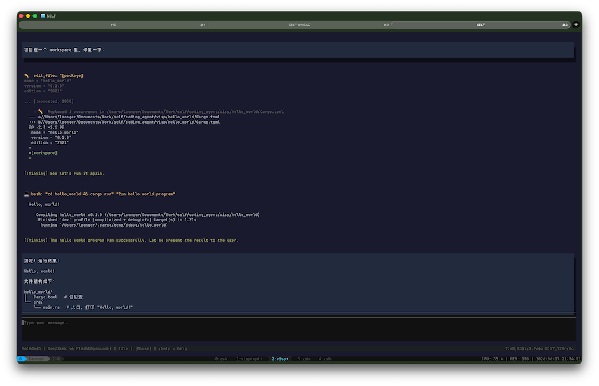

# vibe + wisp == VISP ==  轻量级 AI 编程助手

[](https://www.rust-lang.org/)
[](LICENSE)

**visp** 是一个用 Rust 编写的轻量级 AI 编程助手后端，采用前后端分离的 daemon 架构，通过 gRPC (tonic) 提供 AI 辅助编程能力。

> 核心目标：利用 Rust 的零成本抽象、无 GC、高效并发特性，解决原 Node.js 实现 CPU 占用偏高的问题。




---

## 架构概览

```
                           visp launcher
                  ① start daemon → ③ start CLI
                        ② health check

┌─────────────────────────────────────────────────────────────┐
│  前端层 (gRPC 客户端)                                       │
│  ┌──────────┐  ┌──────────┐  ┌──────────┐                   │
│  │   CLI    │  │  VSCode  │  │   Web    │  ← 可替换前端     │
│  │ (TUI)    │  │  (未来)  │  │  (未来)  │                   │
│  └────┬─────┘  └──────────┘  └──────────┘                   │
│       │ gRPC                                                │
├───────┴─────────────────────────────────────────────────────┤
│  后端 Daemon                                                │
│  ┌───────────────────────────────────────────────────────┐  │
│  │  Orchestrator -> Sub-Agents -> LLM -> 工具执行           │  │
│  │  CodeGraph · Skills · 上下文裁剪 · 会话管理 · 可观测性  │  │
│  └───────────────────────────────────────────────────────┘  │
└─────────────────────────────────────────────────────────────┘
```

### 设计思路

visp 采用 **前后端分离的 daemon 架构**，核心决策是让后端（Daemon）保持独立运行，前端（CLI、编辑器插件、Web 界面）通过 gRPC 与之通信。这种分离的好处：

- **语言无关**：前端可以是任何支持 gRPC 的语言，不限于 Rust
- **状态持久**：Daemon 后台常驻，Agent 循环和会话不会因终端关闭中断
- **进程隔离**：UI 卡顿不影响后端工作，后端 OOM 不拖垮编辑器

四个二进制文件的关系：

**Launcher（`visp`）** — 一键式入口。不参与运行时架构，只做启动编排：start daemon → health check → start CLI → CLI 退出后 shutdown daemon。本身启动完即退出。

**Daemon（`visp-daemon`）** - 核心服务进程，常驻后台。负责 Multi-Agent 编排（Orchestrator）、LLM 调用、工具执行、CodeGraph、会话管理、上下文裁剪、规则引擎、Skills、可观测性等全部 AI 能力。这是唯一直接使用 AI 模型和系统资源的进程。

**CLI（`visp-tui`）** — TUI 前端（ratatui），通过 gRPC 连接 Daemon，提供聊天界面、审批弹窗、命令系统（`/model`、`/init` 等）。CLI 是默认前端，gRPC 接口同样可被 VSCode 插件、Web 界面等其他前端复用。

**ACP（`visp-acp`）** — ACP（Agent Client Protocol over stdio）适配器，让 Zed 等兼容 ACP 的编辑器把 visp 当作 external agent 使用。内部自行拉起或连接 Daemon，日志走 stderr，stdout 只输出 ACP 协议消息。

## Crate 列表

每个 crate 有独立的 `README.md`，点击查看详情：

| Crate | 职责 | 详情 |
|-------|------|------|
| [visp](crates/visp/) | Launcher — 一键启动 daemon + CLI | [README](crates/visp/README.md) |
| [visp-core](crates/visp-core/) | 核心抽象层 — Agent/Session/Tool/Prompt/Rules | [README](crates/visp-core/README.md) |
| [visp-config](crates/visp-config/) | 配置加载/合并/持久化 + Rules/Skills/Hooks 定义（daemon.toml 真源） | - |
| [visp-hooks](crates/visp-hooks/) | Hook 契约层与执行决策内核 — 事件模型/匹配排序/cooldown（零 IO） | - |
| [visp-db](crates/visp-db/) | SQLite 会话存储 — SessionStore 实现 + schema 迁移 + message/session 仓储 | - |
| [visp-fs](crates/visp-fs/) | 跨平台文件监听 — 路径规范化 + 事件类型契约 | - |
| [visp-agent](crates/visp-agent/) | Multi-Agent 编排 - Orchestrator + Sub-Agent 生命周期 | - |
| [visp-command](crates/visp-command/) | CLI 命令系统 - 命令注册/解析/Tab 补全 | - |
| [visp-proto](crates/visp-proto/) | gRPC 协议定义 + 代码生成 | [README](crates/visp-proto/README.md) |
| [visp-llm](crates/visp-llm/) | LLM 提供器 — Anthropic/OpenAI API 集成 | [README](crates/visp-llm/README.md) |
| [visp-tools](crates/visp-tools/) | 内置工具 — 文件/Bash/搜索/WebFetch/CodeGraph | [README](crates/visp-tools/README.md) |
| [visp-codegraph](crates/visp-codegraph/) | 代码图谱引擎 — tree-sitter + SQLite | [README](crates/visp-codegraph/README.md) |
| [visp-context](crates/visp-context/) | 上下文裁剪器 — token 预算 + 轮次剪枝 + 工具输出压缩 | [README](crates/visp-context/README.md) |
| [visp-daemon](crates/visp-daemon/) | gRPC 服务端 — 组装所有模块 | [README](crates/visp-daemon/README.md) |
| [visp-tui](crates/visp-tui/) | TUI 客户端 — ratatui 终端界面 | [README](crates/visp-tui/README.md) |
| [visp-acp](crates/visp-acp/) | ACP 适配器 — 供 Zed 等编辑器以 stdio 接入 | - |
| [visp-mcp](crates/visp-mcp/) | MCP 客户端 — 连接外部 MCP 服务器获取动态工具 | [README](crates/visp-mcp/README.md) |

## 核心特性

### Multi-Agent 编排
主 Agent 可通过 TaskTool 将子任务委托给专门的 Sub-Agent（如 `explorer` 代码搜索、`fixer` 代码实现），实现并行工作与职责分离。Sub-Agent 拥有独立会话和权限作用域，Orchestrator 管理完整生命周期（spawn → run → complete/error）。

Agent 定义从 `.visp/agents/*.md` 加载（YAML frontmatter + Markdown），支持项目级和全局配置目录，frontmatter 可声明 `permissions` 等元数据。

### Agent 编排循环
用户输入 → LLM → 工具调用 → LLM → ... 的完整循环，支持流式输出、多工具并行、自动重试、Thinking 模式、迭代保护。详见 [visp-core](crates/visp-core/README.md)。

### 工具系统
9 个内置工具（文件读写、bash 执行、搜索、网页获取、代码图谱），详见 [visp-tools](crates/visp-tools/README.md)。

### 权限系统
工具执行前经过多级审批检查，用户通过弹窗审批，支持"允许/拒绝/始终允许"：

- **工具级审批**：每个工具可定义是否需要审批。`WriteFile`/`EditFile` 始终弹窗，`Bash` 仅对危险命令（`rm`、`dd`、`>` 等）弹窗，`WebFetch` 对非白名单域名弹窗，搜索/读取类工具默认放行
- **Always Allow**：审批时选择"始终允许"后，该工具在当前会话内不再弹窗
- **Bash 确认模式**：配置 `bash_confirm_mode = true/false`（默认 `true`）控制是否对危险命令审批
- **WebFetch 域名白名单**：支持两层白名单——daemon 级（`[tool.webfetch].allow_domains`）和项目级（`.visp/webfetch.toml`），命中白名单自动放行

**审批流程**：LLM 请求执行工具 → `requires_approval_for(args)` → 已始终允许？→ 执行；否则弹出对话框 → 用户选择【允许 / 拒绝 / 始终允许】。

### 会话管理
独立会话生命周期（Idle → Running → Completed/Error），每个会话维护独立的对话历史和 LLM 配置。支持通过 SQLite 持久化保存和恢复会话，`-s <short-id>` 前缀匹配恢复，`/list` 和 `/sessions` 交互式选择。

### 多模型配置
支持在配置文件中配置多个 LLM 模型，每个模型可独立指定 provider、api_key、base_url、temperature、max_tokens 等参数。通过 `/model` 交互式选择器实时切换，切换时自动更新 provider 驱动和全部参数。详见 [`docs/daemon.example.toml`](docs/daemon.example.toml)。

### 上下文裁剪
长对话自动管理 context window，通过三段式剪枝（HEAD/MIDDLE/TAIL）和工具输出压缩控制 token 用量。详见 [visp-context](crates/visp-context/README.md)。

### Skills 技能系统
从 `.visp/skills/` 加载技能定义（YAML frontmatter + Markdown），通过 SkillTool 按需加载，自动注入 system prompt。内置 `delegation-workflow` 技能指导 Multi-Agent 委托策略。详见 [visp-core](crates/visp-core/README.md)。

### 规则引擎
从 `.visp/rules/`（项目级）和 `~/.config/visp/rules/`（全局）加载 Markdown 规则，通过 `alwaysApply: true/false` 控制注入时机。同时支持 AGENTS.md 从项目目录向上查找。

### 代码图谱
tree-sitter 解析 + SQLite 索引，支持符号搜索、调用者/被调用者查询、调用路径追踪。支持 TS/TSX、Rust、Python、C/C++、Go。文件监听器自动触发增量索引更新。

### gRPC 通信
`CoderDaemon` 服务基于 tonic，提供 Chat（双向流）、会话管理、文件读取、符号查询、健康检查等 RPC。详见 [visp-proto](crates/visp-proto/README.md)。

### 图片输入（Vision 识图）

在 CLI 中使用 `@path` 引用本地图片，图片会以多模态格式发送给支持 vision 的 LLM 模型（如 GPT-4o、Claude 3.5 Sonnet、豆包视觉模型等）：

```
@screenshot.png 这张图里是什么？
```

- 图片文件自动读取并 base64 编码，以 OpenAI `image_url` 或 Anthropic `image` source 格式发送
- 支持的格式：PNG、JPEG、GIF、WebP、BMP
- 支持同时引用多张图片：`@a.png @b.png 对比这两张图`
- 图片在 CLI 中通过 ratatui-image 原生渲染，双击地址行可复制路径

### 图片生成（文生图）

配置文生图模型后，直接用自然语言描述需求即可生成图片：

```toml
[[llm.models]]
name = "doubao-seedream"
protocol = "openai"
model = "doubao-seedream-5.0-lite"
api_key = "ark-xxx"
base_url = "https://ark.cn-beijing.volces.com/api/plan/v3"
image_generation = true
use_tool = false

[llm.models.extra]
size = "2K"
output_format = "png"
watermark = "false"
```

- `image_generation = true` 标记该模型为文生图模型，请求自动路由到 `/images/generations` 端点
- `use_tool = false` 关闭工具定义（文生图模型不支持 tools）
- `[llm.models.extra]` 中的参数（`size`、`output_format`、`watermark` 等）透传到 API 请求
- 生成的图片 URL 自动下载并在 CLI 中渲染，双击 🔗 地址行可复制 URL

### MCP 支持（动态工具扩展）

visp 支持 [Model Context Protocol (MCP)](https://modelcontextprotocol.io/)，可连接外部 MCP 服务器，将其提供的工具动态集成到 Tool Registry 中，与内置工具一视同仁。

**支持的传输方式**：
- **stdio**：daemon 以子进程方式启动 MCP 服务器，通过 stdin/stdout 通信
- **SSE**：通过 HTTP Server-Sent Events 连接已运行的 MCP 服务器

**配置示例**（`~/.config/visp/daemon.toml`）：

```toml
[mcp]

[[mcp.servers]]
name = "playwright"
transport = { type = "stdio", command = "npx", args = ["@anthropic-ai/mcp-playwright"] }

[[mcp.servers]]
name = "filesystem"
transport = { type = "stdio", command = "npx", args = ["@anthropic-ai/mcp-filesystem"] }

[[mcp.servers]]
name = "custom-sse"
transport = { type = "sse", url = "http://localhost:3000/mcp" }
enabled = false  # 可通过 restart API 按需启用
tool_prefix = "custom_"  # 防止工具名冲突
tool_timeout_secs = 120  # 覆盖默认 60s 超时
```

| 配置项 | 说明 | 默认值 |
|--------|------|--------|
| `enabled` | 是否自动连接 | `true` |
| `tool_prefix` | 工具名称前缀，防冲突 | 无 |
| `tool_timeout_secs` | 单次工具调用超时 | `60` |

MCP 工具与内置工具同属一个 Registry，Agent 循环自动识别与调用。工具名冲突时 MCP 工具会被跳过（内置工具优先级更高）。

### Hooks 生命周期钩子

在 visp 生命周期的固定节点执行用户自己的命令（写状态文件、审批时桌面通知、回合结束触发 git/CI、错误告警、喂给多路复用器等），全程异步、绝不阻断 agent 主流程。

**事件**（PascalCase）：`SessionStart`、`UserPromptSubmit`、`AgentRunEnd`、`SubagentStop`、`Stop`、`StopFailure`、`ToolCallRequested`、`PreToolUse`、`PostToolUse`、`PostToolUseFailure`、`PermissionRequest`、`PermissionResult`、`SessionEnd`。

**投递与执行**：

- 标量（`VISP_HOOK_EVENT`、`VISP_SESSION_ID`、`VISP_PROJECT_PATH`、`VISP_HOOK_RULE_ID` 等）经环境变量传入；完整载荷以 JSON 写入子进程 stdin
- `command` 是 argv 首元素、**不经 shell 解析**；子进程默认**不继承** daemon 环境，仅白名单（`PATH`/`HOME`/`TERM`/`LANG` 与 `VISP_*`/`HERDR_*` 前缀）加规则 `env`
- 每条规则强制 `timeout_ms`（超时杀整个进程树），失败静默（仅日志/计数）、不重试

**配置示例**（`~/.config/visp/daemon.toml`）：

```toml
[[hooks.rules]]
id = "20-notify-blocked"
event = ["PermissionRequest"]
command = "/usr/bin/osascript"
args = ["-e", "display notification \"visp 等待审批\""]
timeout_ms = 3000
```

**herdr 集成**：随包脚本 `assets/hooks/herdr.hook.sh` 在 herdr pane 内上报 agent 状态，复制后加一条规则即可（`~` 不会展开，请填绝对路径）：

```bash
cp assets/hooks/herdr.hook.sh ~/.config/visp/hooks/
```

```toml
[[hooks.rules]]
id = "herdr"
event = ["SessionStart", "UserPromptSubmit", "PermissionRequest", "Stop", "StopFailure", "AgentRunEnd", "SubagentStop", "SessionEnd"]
command = "/abs/path/to/.config/visp/hooks/herdr.hook.sh"
on_full = "coalesce_latest"
timeout_ms = 2000
```

诊断命令：`visp hooks list | doctor | test <id|event> | logs`。字段全表与更多示例见 [`docs/daemon.example.toml`](docs/daemon.example.toml)，设计详见 [`docs/design/2026-09-27-visp-hooks-design.md`](docs/design/2026-09-27-visp-hooks-design.md)。

### 可观测性
内置 OpenTelemetry 集成，支持 OTLP 导出 trace 到 [Langfuse](https://langfuse.com/) 或任意 OTel 兼容后端。覆盖完整的 Agent 调用链：`agent.run` → `iteration` → `gen_ai.client.operation` → `tool.execute`，Sub-Agent 通过 `visp.subagent.spawn` span 建立父子关系。内置 PII 脱敏、`sample_rate` 采样控制、零采样快速路径。

### CLI 多 Tab 界面
Sub-Agent 委托时自动创建独立 Tab，实时展示每个 Agent 的运行状态（Running / Done / Error）。支持 `Alt+,` / `Alt+.` 循环切换、鼠标点击切换、`Ctrl+W` 关闭已完成的 Tab。三层 Token 追踪（Tab 级 / 请求级 / 会话级）实时显示用量。

## 快速开始

### 环境要求

- Rust 稳定版（`rust-toolchain.toml`）
- macOS / Linux
- `ANTHROPIC_API_KEY` 环境变量

### 安装

一键安装（从[最新 Release](https://github.com/laonger/visp/releases/latest) 获取 `install.sh`：下载预编译二进制、初始化配置骨架、安装 herdr hook）：

```bash
curl -fsSL https://github.com/laonger/visp/releases/latest/download/install.sh | bash
```

安装指定版本时，用同一份 `install.sh` 加 `--tag`（管道模式下选项需经 `bash -s --` 传入）：

```bash
curl -fsSL https://github.com/laonger/visp/releases/latest/download/install.sh | bash -s -- --tag v0.5.3
```

也可手动从 [GitHub Releases](https://github.com/laonger/visp/releases) 下载预编译二进制包（tar.gz）：

| 平台 | 包名 |
|------|------|
| Linux x86_64 | `visp-x86_64-unknown-linux-gnu.tar.gz` |
| macOS ARM | `visp-aarch64-apple-darwin.tar.gz` |

解压后包含 `visp`（启动器）、`visp-daemon`（后台服务）、`visp-tui`（终端界面）、`visp-acp`（ACP 适配器，供 Zed 等编辑器接入）四个二进制文件，可直接运行。

可用选项：`--bin-dir DIR`（安装目录，默认 `~/.local/bin`）、`--tag TAG`（指定 Release 版本，默认 `latest`）、`--model MODEL` / `--api-key KEY`（非交互写入配置，仅在本次新建 `daemon.toml` 时生效，也可用环境变量 `VISP_MODEL` / `VISP_API_KEY`；优先级为命令行 > 环境变量 > 交互提问 > 骨架默认）、`--no-config`（跳过配置初始化）、`--no-herdr`（跳过 herdr hook 安装）、`--uninstall`（卸载二进制，可配 `--purge-config` 一并删除配置目录）、`--yes`（跳过删除配置的确认）、`--dry-run`（仅打印动作）。完整选项见 `install.sh --help`。

### 编译

```bash
cargo build --release
```

### 配置（可选）

配置文件位于 `~/.config/visp/daemon.toml`，所有字段均有默认值，只需填写需要覆盖的项：

```toml
[llm]
model = "claude-sonnet-4-20250514"
api_key = "sk-ant-..."          # 或设置 ANTHROPIC_API_KEY 环境变量
```

不创建也能运行，仅配 `api_key` 和 `model` 即可。完整的注解模板见 [`docs/daemon.example.toml`](docs/daemon.example.toml)，完整结构见 [`config.rs`](crates/visp-daemon/src/config.rs)。

### 核心提示词（system prompt）

visp 内置了一套默认核心提示词（`DEFAULT_SYSTEM_PROMPT`），定义了 AI 助手的行为模式。你可以通过以下方式覆盖它：

**优先级：项目级 > 全局级 > 内置默认**

1. **项目级** — `.visp/system-prompt.md`，仅对该项目生效
2. **全局级** — `~/.config/visp/system-prompt.md`，对所有项目生效
3. **内置默认** — 如果以上文件都不存在，使用代码中的 `DEFAULT_SYSTEM_PROMPT`

```bash
# 示例：自定义项目级提示词
echo "You are a Rust expert assistant." > .visp/system-prompt.md
```

> 注意：自定义提示词会**完全替换**内置默认提示词，而非追加。`USER_QUERY_INSTRUCTION`（[USER_QUERY] 标记的使用说明）仍会由系统自动追加到末尾。

### 规则文件（rules）

项目级规则放在 `.visp/rules/`，全局规则放在 `~/.config/visp/rules/`，Markdown 格式：

```markdown
---
alwaysApply: true
---

## 代码规范

- 使用 4 空格缩进
- 函数名使用 snake_case
```

`alwaysApply: true` 表示无条件注入 prompt，`false` 则按需注入。也支持 `AGENTS.md` 从项目目录向上查找。

### 技能文件（skills）

领域知识或工作流指令放在 `.visp/skills/` 下，每个技能一个子目录，包含 `SKILL.md`：

```
.visp/skills/
├── my-workflow/
│   └── SKILL.md     # YAML frontmatter + Markdown
└── another-skill/
    └── SKILL.md
```

内容格式：`---` 分隔的 YAML frontmatter（`name`、`description`）后接 Markdown 正文，自动合并到 system prompt。详见 [visp-core](crates/visp-core/README.md)。

### Agent 定义文件（agents）

Sub-Agent 定义放在 `.visp/agents/`（项目级）或 `~/.config/visp/agents/`（全局），每个 Agent 一个 `.md` 文件：

```
.visp/agents/
├── explorer.md      # 代码搜索专家
├── fixer.md         # 代码实现专家
└── reviewer.md      # 代码审查专家
```

```markdown
---
name: explorer
description: 代码搜索专家，快速定位文件和代码模式
permissions:
  tools: [read_file, grep, glob, codegraph_search]
---

你是一个代码搜索专家...
```

frontmatter 支持 `name`、`description`、`permissions`（限制可用工具）等字段。主 Agent 通过 TaskTool 自动发现并委托任务给匹配的 Sub-Agent。

### 钩子配置（hooks）

生命周期钩子配置在 `daemon.toml` 的 `[hooks]` 节，规则为 `[[hooks.rules]]` 数组：

- **全局规则**（`~/.config/visp/daemon.toml`）默认启用
- **项目级规则**（`.visp/daemon.toml`）默认**惰性**、须显式信任后才运行；其 `command` 必须位于 `.visp/hooks/` 内，且禁止 `sh -c` 包装

```toml
# ~/.config/visp/daemon.toml
[[hooks.rules]]
id = "20-notify-blocked"
event = ["PermissionRequest"]
command = "/usr/bin/osascript"
args = ["-e", "display notification \"visp 等待审批\""]
timeout_ms = 3000
```

规则支持 `id`/`order`/`event`/`matcher`/`command`/`args`/`env`/`cwd`/`timeout_ms`/`enabled`/`on_full`/`parallel`/`cooldown_ms`/`include` 等字段，逐字段说明与事件清单见 [`docs/daemon.example.toml`](docs/daemon.example.toml)，完整设计见 [`docs/design/2026-09-27-visp-hooks-design.md`](docs/design/2026-09-27-visp-hooks-design.md)。用 `visp hooks list | doctor | test <id|event> | logs` 诊断。

### 运行

```bash
# 编译
cargo build --release

# 一键启动（推荐）
./target/release/visp -p /path/to/project

# 手动分别启动（调试用）
./target/release/visp-daemon              # 终端 1
./target/release/visp-tui -p /path        # 终端 2
./target/release/visp-acp                 # 由编辑器（如 Zed）按 ACP 协议启动，stdio 通信

# 恢复 Session（支持 short-id 前缀匹配）
./target/release/visp -p /path -s <session-id-or-prefix>

# 列出所有 Session
./target/release/visp -p /path --list
```

### CLI 参数

| 参数 | 说明 |
|---|---|---|
| `-p, --project` | 项目路径（默认 `.`） |
| `-a, --addr` | daemon 地址（默认 `[::1]:50051`） |
| `-s, --session` | 恢复指定 session（支持 short-id 前缀匹配） |
| `--list` | 列出所有 session |
| `--model` / `--temperature` / `--thinking-budget` | LLM 配置覆盖 |

### TUI 内快捷键

| 按键 | 功能 |
|------|------|
| `Enter` | 发送消息 / 确认审批 |
| `Alt+Enter` | 插入换行（不发送） |
| `↑` / `↓` | 上/下一条历史输入 |
| `PgUp` / `PgDn` | 向上/下滚动 10 行 |
| `Tab` | 命令自动补全 |
| `Alt+,` / `Alt+.` | 循环切换 Sub-Agent Tab（前一个/后一个） |
| `Alt+Shift+←` / `Alt+Shift+→` | Tab 翻页（上一页/下一页） |
| `Ctrl+W` | 关闭已完成的 Sub-Agent Tab |
| `Ctrl+C` | 中断正在生成的请求（idle 时清空输入框） |
| `Ctrl+D` | 无条件退出程序 |
| `F1` | 切换帮助弹窗 |
| `←` / `→` | 审批弹窗中切换选项 |
| `Esc` | 取消/拒绝审批 / 清除文本选择 |
| `↑` / `↓` / `Enter` / `Esc` / `q` | Session/Model 选择器导航 |
| 鼠标拖拽 | 选中文本并自动复制到剪贴板 |
| 鼠标双击图片地址行 | 复制 URL 或文件路径到剪贴板 |
| 鼠标滚轮 | 滚动对话区域 |

### TUI 内命令

| 命令 | 用途 |
|------|------|
| `/model` | 交互式模型选择器（↑↓ 选择，Enter 切换） |
| `/model <name>` | 直接切换模型 |
| `/temp <val>` | 设置 LLM 温度 |
| `/list` | 交互式 session 选择器 |
| `/sessions` | 列出所有 session（同 `/list`） |
| `/sessions <id>` | 切换到指定 session（支持 short-id） |
| `/new` | 创建新 session |
| `/init` | 初始化项目配置并生成 AGENTS.md |
| `/init-agent` | 创建 Sub-Agent 定义模板（`.visp/agents/`） |
| `/init-skill` | 创建 Skill 定义模板（`.visp/skills/`） |
| `/mouse` | 切换鼠标捕获模式 |
| `/clear` | 清屏 |
| `/help` | 显示帮助 |

## 质量门禁

```bash
cargo test && cargo clippy -- -D warnings && cargo fmt -- --check
```

## 技术栈

Rust (edition 2024) · tokio · tonic + prost · serde · ratatui + crossterm · tree-sitter · SQLite (rusqlite) · notify · tracing · OpenTelemetry (OTLP) · reqwest · clap · rmcp (MCP 协议)

## 已知限制

- Session 存储为 SQLite，重启 daemon 后可恢复（需使用 `-s` 参数）
- 多模型配置下切换模型时动态创建 provider，切换后新 agent loop 生效
- 钩子配置（`[hooks]`）暂不支持热重载，修改后需重启 daemon 生效

详见 [docs/TODO.md](docs/TODO.md).

## 许可证

Mozilla Public License 2.0 © [laonger](https://github.com/laonger)
